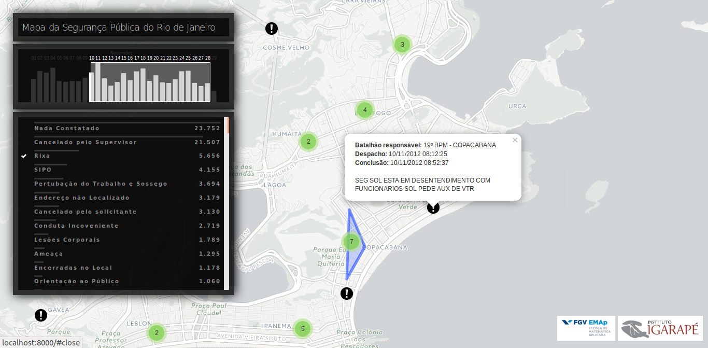

# What it it?
SegPub is a webapp that aims to visualize public security incidents, answering questions such as:
 1. Where there were more injuries during the last week?
 2. What have been the most frequent incident this month?
 3. In which slice of the day there was more threats?

# How does it works?
The idea is to build these three interactive histograms that cross filter each other and the map:

* Distribution of incidents per category.
* Distribution of incidents through the current month.
* Distribution of incidents through the hours of the day.


After select one category, the map and the other two histograms are refreshed showing the spatial, daily and hourly distribution of the selected category incidents. Similarly, after select a slice of the month or of the day, the whole visualization is refreshed.



# Known bugs and limitations.
* For while, there are only two histograms (category and daily distribution) and they are only filtering the map.
* There are some `undefined` values at some incidents details.

# Setup the dev environment

The first step is [install nodejs](https://github.com/joyent/node/wiki/Installing-Node.js-via-package-manager).

After that, install node modules, download csv and start the app:

```bash
$ npm install
$ npm run get-data
$ npm start
```

Similarly, to run tests:

```bash
$ npm test
```

If you want to run frontend tasks manually, install `grunt` globally:

```bash
$ sudo npm install -g grunt
$ sudo npm install -g grunt-cli
```

